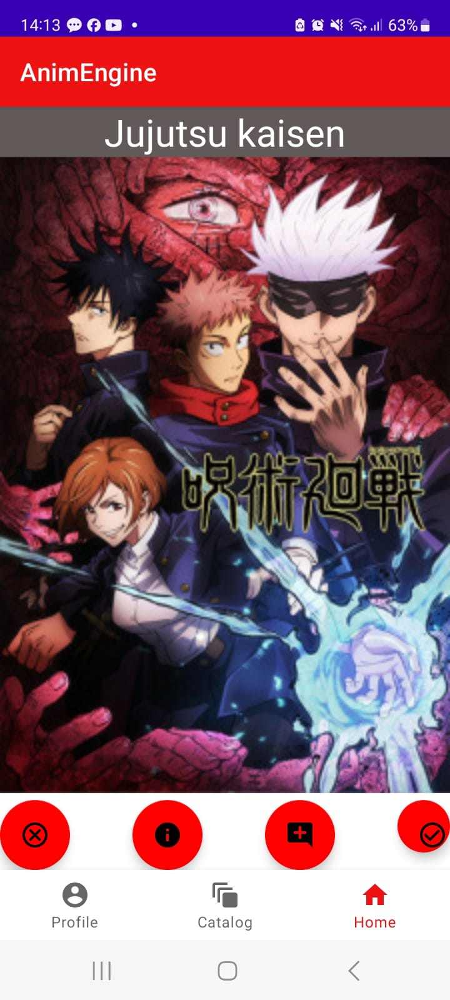
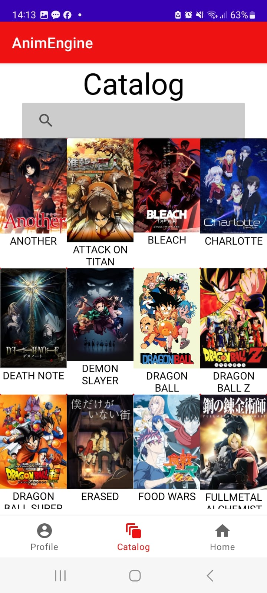
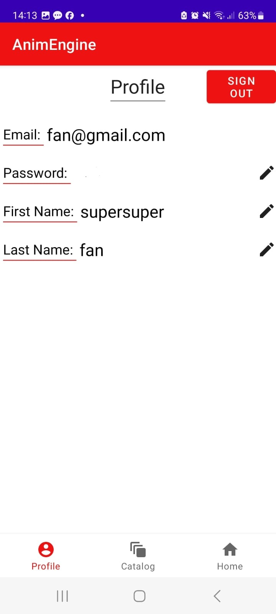

## Preview
### Fan

    
    
    

    <em>Engine: The engine is where you can select 'V' to express interest or 'X' to decline for each anime. You can also access additional information, like or dislike the anime, and add comments. Pressing 'V' or 'X' will advance to the next anime.</em>  
    <em>Catalog: In the catalog you can explore all existing anime in the system. You can access detailed information about each anime, including descriptions, ratings, and more.</em>  
    <em>Profile: This is a user profile screen where you can edit your profile information or sign out of the system.</em>

### Creator

