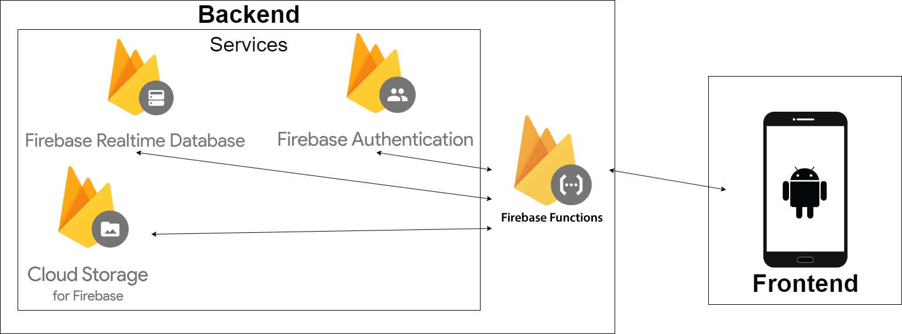
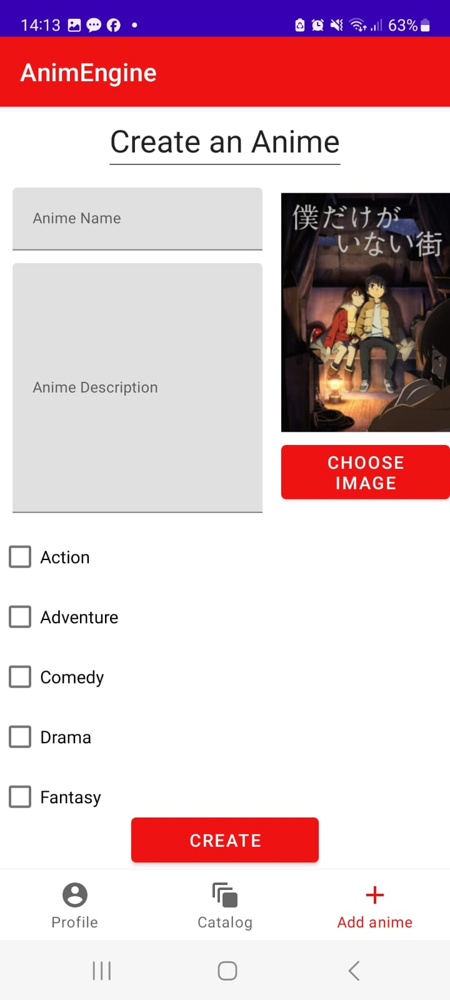
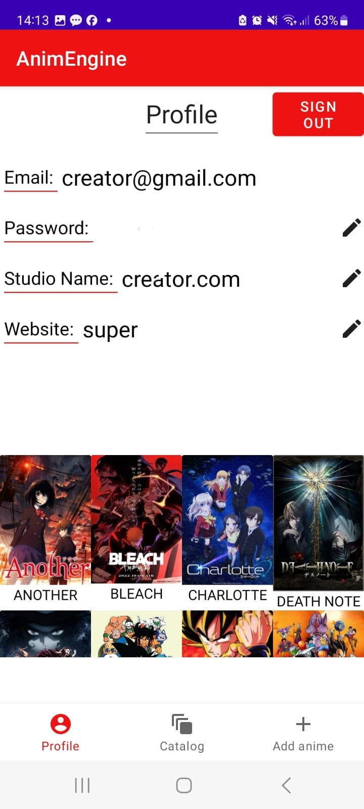

# About
"AnimEngine" is an Anime recommendation platform for Anime fans.  

The app offers interfaces for both fans and creators.  
The app recommends anime for the fan to watch based on previous animes they've watched and liked/disliked.  
Creators are invited to add their anime to the public collection of anime for it to be recommended to fans to watch.  

Users can also search the database and read about anime and their descriptions.

# System Description
  
## Backend
Technologies used: 
- Firebase Functions
- Firebase Storage
- Firebase Realtime Database
- Firebase Authentication
The backend is built in a serverless fashion Using _**Firebase Functions**_.  
The serverless backend acts as an application server for the client to send requests to.  

The client only interacts with the serverless functions which then interact with the various _**Firebase Services**_.  

## Frontend
Currently, we only created an Android app client written in native Android with Java.  
In the future, we can create client applications for different platforms and connect them to the existing application server.

# Preview
## Fan

    
    
    

    <em>Engine: The engine is where you can select 'V' to express interest or 'X' to decline for each anime. You can also access additional information, like or dislike the anime, and add comments. Pressing 'V' or 'X' will advance to the next anime.</em>  
    <em>Catalog: In the catalog you can explore all existing anime in the system. You can access detailed information about each anime, including descriptions, ratings, and more.</em>  
    <em>Profile: This is a user profile screen where you can edit your profile information or sign out of the system.</em>

## Creator

    
    
    

    <em>Add Anime: The main activity of a creator is to create his own anime an upload it to the engine.</em>  
    <em>Catalog: In the catalog you can explore all existing anime in the system. You can access detailed information about each anime, including descriptions, ratings, and more.</em>  
    <em>Profile: This is a user profile screen where you can edit your profile information or sign out of the system. The creator can explore his uploaded animes in the profile.</em>

